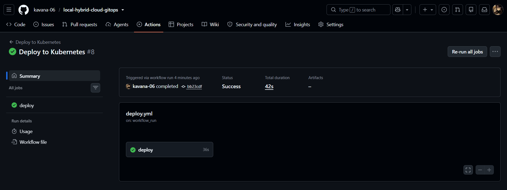
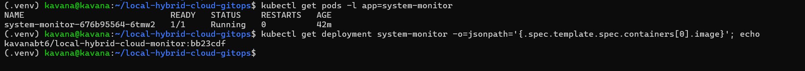
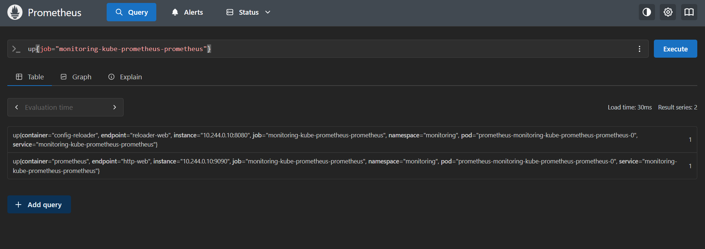
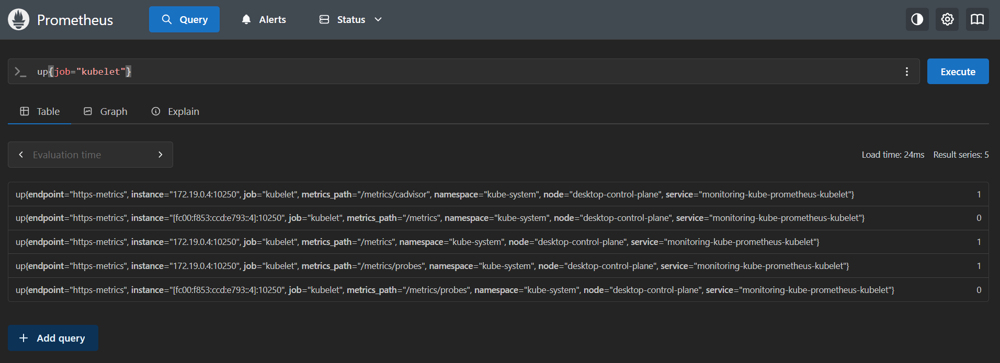
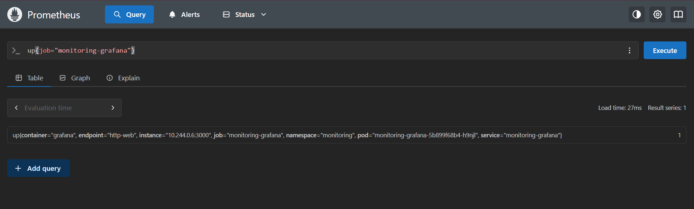
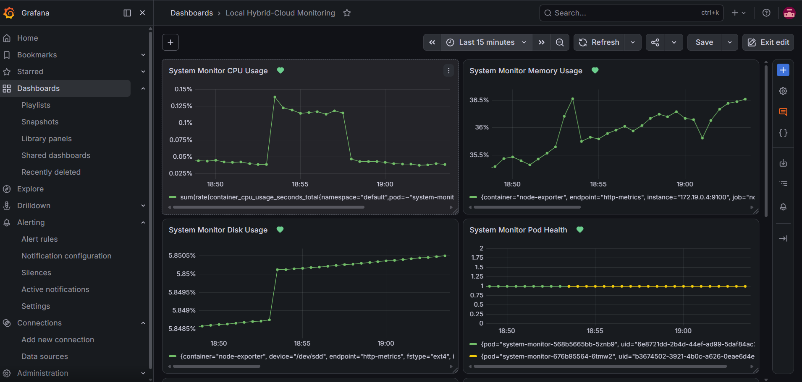
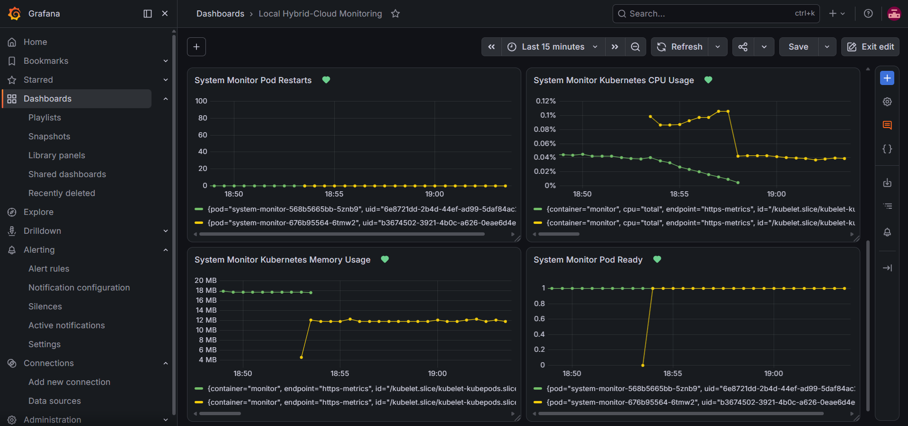
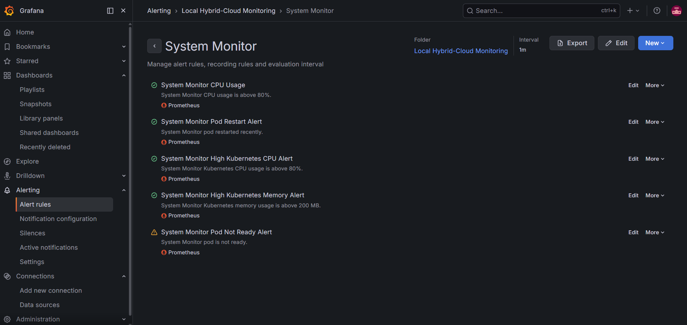

# Local Hybrid-Cloud GitOps Platform

A cloud-native monitoring and deployment platform combining **Python system monitoring, Docker, Kubernetes, Prometheus, Grafana, Alertmanager, and GitHub Actions CI/CD**.

The project demonstrates an automated workflow from source control to container build, registry publishing, Kubernetes deployment, monitoring, and alerting.

---

## Architecture

```text
Developer
   │
   │ Git Push
   ▼
GitHub Repository
   │
   ├──────────────► GitHub Actions CI
   │                    │
   │                    └── Python + Kubernetes validation
   │
   └──────────────► Docker Build Pipeline
                        │
                        ├── Build Docker Image
                        └── Push to Docker Hub
                                   │
                                   ▼
                         Self-Hosted GitHub Runner
                                   │
                                   ▼
                            Local Kubernetes
                                   │
                           ┌───────┴────────┐
                           │                │
                    System Monitor       Kubernetes
                       Pod               Resources
                           │                │
                           └───────┬────────┘
                                   ▼
                              Prometheus
                                   │
                                   ▼
                                Grafana
                                   │
                     ┌─────────────┴─────────────┐
                     │                           │
                Dashboards                  Alert Rules
                                                 │
                                                 ▼
                                           Alertmanager
```

---

## Key Features

### System Monitoring

The Python monitoring service collects system-level metrics including:

* CPU usage
* Memory usage
* Disk usage
* System health
* Monitoring logs
* HTTP health endpoint

### Containerization

The application is packaged using Docker to provide a consistent runtime environment.

### Kubernetes

The application is deployed to a local Kubernetes cluster with:

* Deployment
* Service
* Health probes
* Persistent monitoring logs
* Kubernetes resource monitoring

### Observability

The platform uses **Prometheus and Grafana** for monitoring and visualization.

Grafana dashboards monitor:

* CPU usage
* Memory usage
* Disk usage
* Pod health
* Pod restarts
* Kubernetes CPU usage
* Kubernetes memory usage
* Pod readiness

### Alerting

Alert rules are configured for conditions such as:

* High CPU usage
* High memory usage
* High disk usage
* Pod health problems
* Pod restarts
* Kubernetes resource pressure
* Pod readiness failures

Alertmanager provides alert management and notification routing.

---

## CI/CD Pipeline

The project implements automated CI/CD using GitHub Actions.

### Continuous Integration

Every push to `main` triggers validation for:

* Python syntax
* Kubernetes YAML syntax

### Docker Image Pipeline

The Docker workflow:

1. Checks out the repository
2. Authenticates with Docker Hub
3. Builds the Docker image
4. Tags the image using the Git commit SHA
5. Pushes the image to Docker Hub

### Continuous Deployment

The deployment workflow:

1. Detects a successful Docker build
2. Runs on a self-hosted GitHub Actions runner
3. Updates the Kubernetes image tag
4. Applies the Kubernetes manifest
5. Waits for the deployment rollout
6. Verifies the Kubernetes workload

The resulting workflow is:

```text
Git Push
   ↓
CI Validation
   ↓
Docker Build
   ↓
Docker Hub
   ↓
Self-Hosted Runner
   ↓
Kubernetes Deployment
   ↓
Prometheus
   ↓
Grafana + Alertmanager
```

---

## Technology Stack

| Area               | Technology              |
| ------------------ | ----------------------- |
| Programming        | Python                  |
| System Monitoring  | psutil                  |
| Containerization   | Docker                  |
| Orchestration      | Kubernetes              |
| Metrics            | Prometheus              |
| Visualization      | Grafana                 |
| Alerting           | Alertmanager            |
| CI/CD              | GitHub Actions          |
| Container Registry | Docker Hub              |
| Environment        | WSL2 + Local Kubernetes |
| Version Control    | Git + GitHub            |

---

## Project Structure

```text
local-hybrid-cloud-gitops/
│
├── .github/
│   └── workflows/
│       ├── ci.yml
│       ├── docker.yml
│       └── deploy.yml
│
├── app/
│   └── monitor.py
│
├── k8s/
│   └── deployment.yaml
│
├── Dockerfile
├── docker-compose.yml
├── .gitignore
└── README.md
```

---

## CI/CD Verification

The deployment pipeline has been tested end-to-end.

Example successful Kubernetes deployment:

```text
Pod:
system-monitor-568b5665bb-5znb9   1/1   Running   0

Image:
kavanabt6/local-hybrid-cloud-monitor:b53f6aa
```

The image tag corresponds to the Git commit used by the deployment pipeline.

---

## Monitoring Verification

The Kubernetes workload has been tested with:

* Normal CPU usage
* Normal memory usage
* Normal disk usage
* Pod health monitoring
* Pod restart detection
* Kubernetes resource monitoring
* Pod readiness monitoring
* Alert rule evaluation
---

## Project Screenshots

### CI/CD Deployment



---

### Kubernetes Deployment



---

### Prometheus Metrics







---

### Grafana Monitoring Dashboard





---

### Alert Rules



---

## Engineering Concepts Demonstrated

* Cloud-native application architecture
* Containerization
* Kubernetes deployments
* Kubernetes health probes
* CI/CD automation
* Self-hosted GitHub Actions runners
* Docker image versioning
* Prometheus metrics
* Grafana dashboards
* Alertmanager alerting
* GitOps workflows
* Linux/WSL administration
* Infrastructure automation
* Troubleshooting Kubernetes workloads

---

## Future Improvements

* Terraform-based infrastructure provisioning
* Kubernetes Ingress
* TLS/HTTPS
* Horizontal Pod Autoscaling
* Centralized logging
* Loki integration
* Alertmanager email/Slack integration
* Secrets management
* Automated rollback
* Multi-environment deployments
* Cloud deployment to Azure or AWS

---

## Author

**Kavana**

Computer Science student focused on **Cloud Computing, DevOps, automation, and data-driven solutions**.
